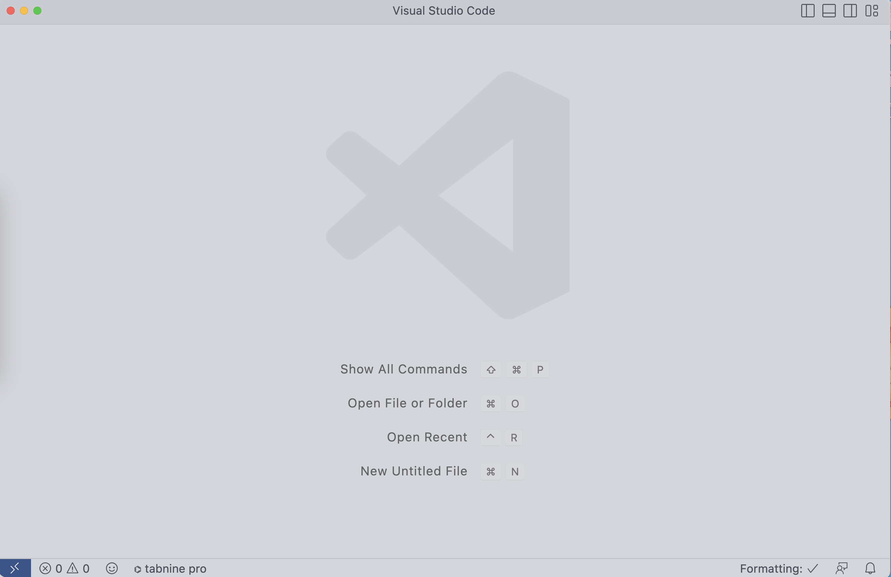
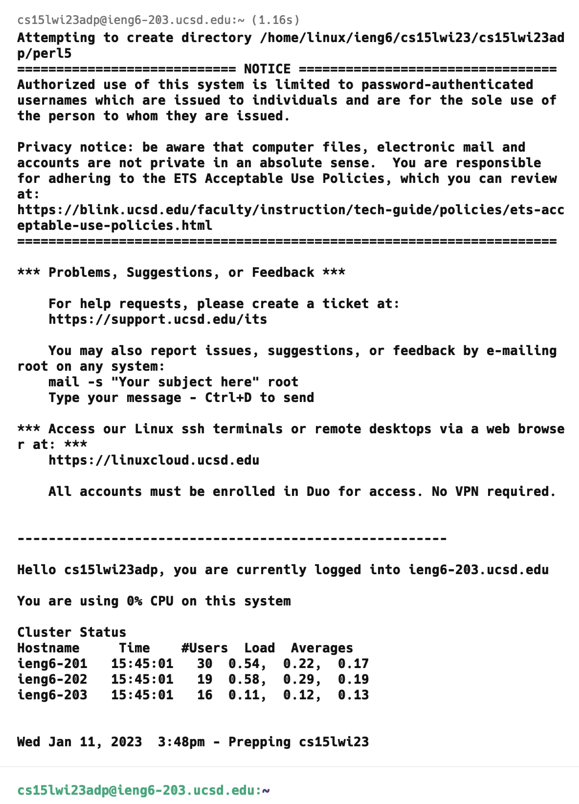
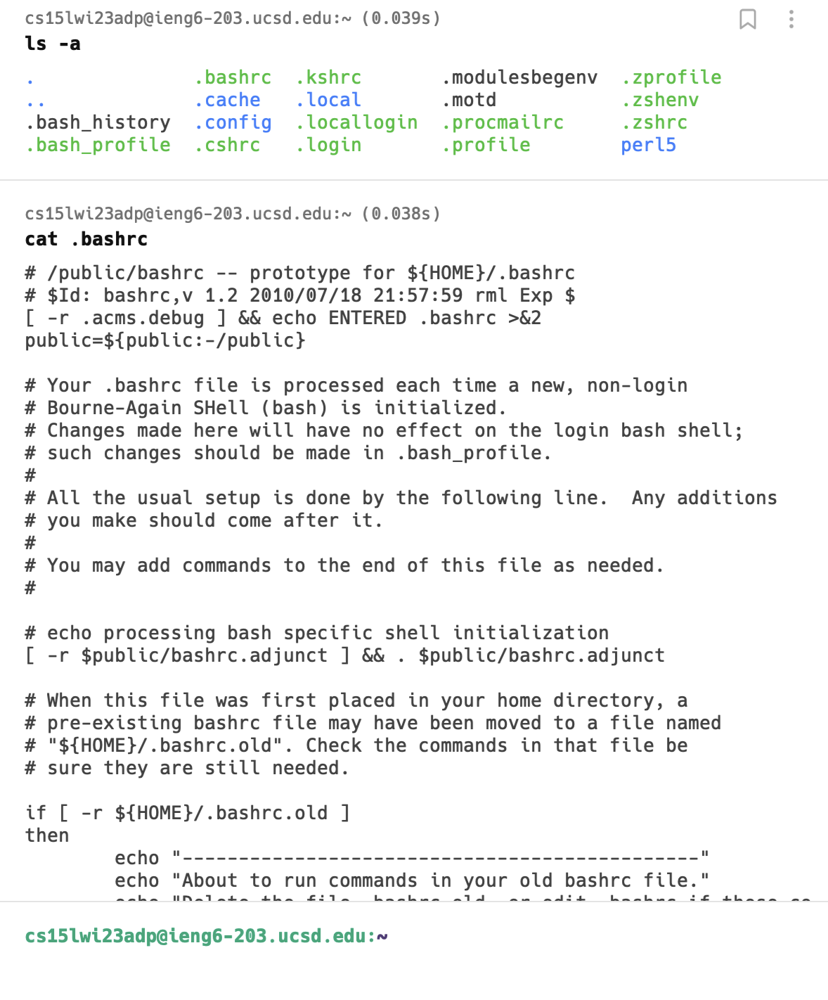

# Installing VScode 

Navigate to [vscode website]( https://code.visualstudio.com/) and follow the download instructions. Once you install VScode you should have a tab similar to this 



Mine looks a little different since I am using a custom theme. If you want to match with me, you can install the [following extention.](https://marketplace.visualstudio.com/items?itemName=enkia.tokyo-night)


# Remote Access into Virtual Machine

Now let us cover how to access your remote linux virtual machine. 

### Install Git (Windows only)
Navigate to the [git website](https://git-scm.com/) and install the appropriate version for your machine. If you are using mac or linux, your system comes preinstalled with git.

Then, open your VSCode and follow [these](https://stackoverflow.com/questions/42606837/how-do-i-use-bash-on-windows-from-the-visual-studio-code-integrated-terminal/50527994#50527994) instructions for changing your terminal to a Bash shell. Now your terminal environment should be set up!

### SSH into Virtual Machine

Navigate to [Educational Technology Services website](https://sdacs.ucsd.edu/~icc/index.php) to get your SSH credentials for your ieng Virtual Machine Instance. If it is your first time accessing the virtual machine, you may have to set up your password. Here is a quick [guide](https://docs.google.com/document/d/1hs7CyQeh-MdUfM9uv99i8tqfneos6Y8bDU0uhn1wqho/edit) to change your password safely without affecting your regular UCSD account. 

Your crediential should look something like this: ```cs15lwi23zz```. (Note the zz part will be different) 

Now write the following command into your terminal: \
```ssh cs15lwi23zz@ieng6.ucsd.edu ```

You should get a response body similar to this: 
```
ssh cs15lwi23zz@ieng6.ucsd.edu
The authenticity of host 'ieng6.ucsd.edu (128.54.70.227)' can't be established.
RSA key fingerprint is SHA256:ksruYwhnYH+sySHnHAtLUHngrPEyZTDl/1x99wUQcec.
Are you sure you want to continue connecting (yes/no/[fingerprint])?  
```

Type ``` yes ``` into the terminal to connect to the Virtual Machine. After you type your password you should see the following response: 




Congratulations You have finally accessed your virtual machine instance. Play around with some bash commands and get comfortable in the terminal. You will be using it alot in the future. 0.o



Here I ran the ```ls -a ``` command which lists all directories, including hidden ones. The second command I ran was ```cat .bashrc``` which outputs the bashrc file of the virtual machine. If you want to learn more about these commands, click this [link](https://www.educative.io/blog/bash-shell-command-cheat-sheet). 

Happy coding!